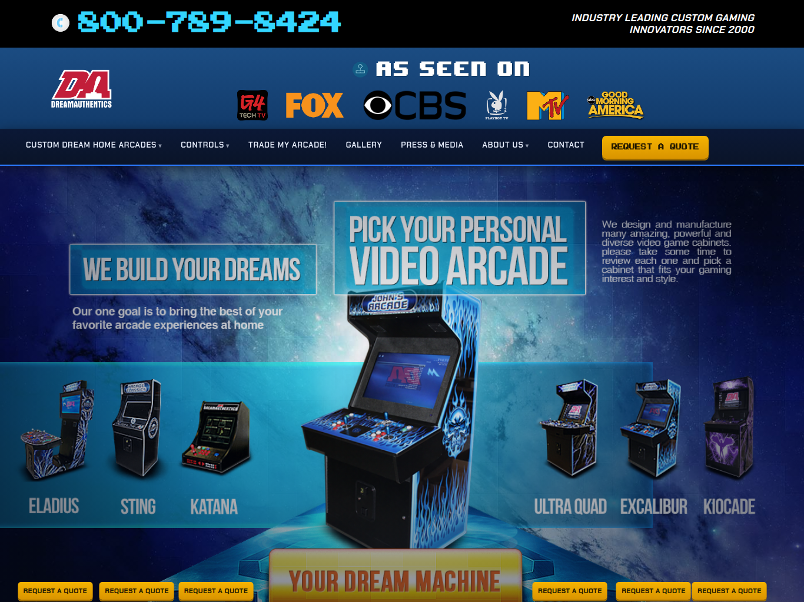
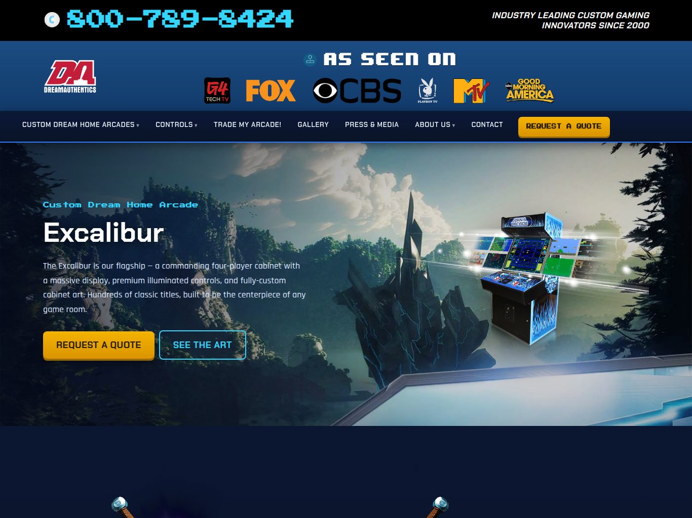

# DreamAuthentics — dreamauthentics.com

The DreamAuthentics website: the world's premier custom home arcade machines, since 2000.
Rebuilt as a modern static site and migrated off the old host.

- **Live:** https://dreamauthentics.com
- **Stack:** [Astro](https://astro.build) (static) · Cloudflare Pages · Pages Functions (quote form → Resend)
- **Features:** custom arcade & controls showcase, searchable Game List, design portfolio, press,
  a recovered blog with a Sveltia visual CMS at `/admin/`, full SEO (sitemap, robots, structured data),
  and ~200 legacy 301 redirects preserving 20 years of search equity.

## Screenshots




## Develop

```bash
npm install
npm run dev      # local dev
npm run build    # build to dist/ (also generates sitemap.xml)
```

Deploy: `npx wrangler pages deploy dist --project-name=dreamauthentics-new --branch=main`
